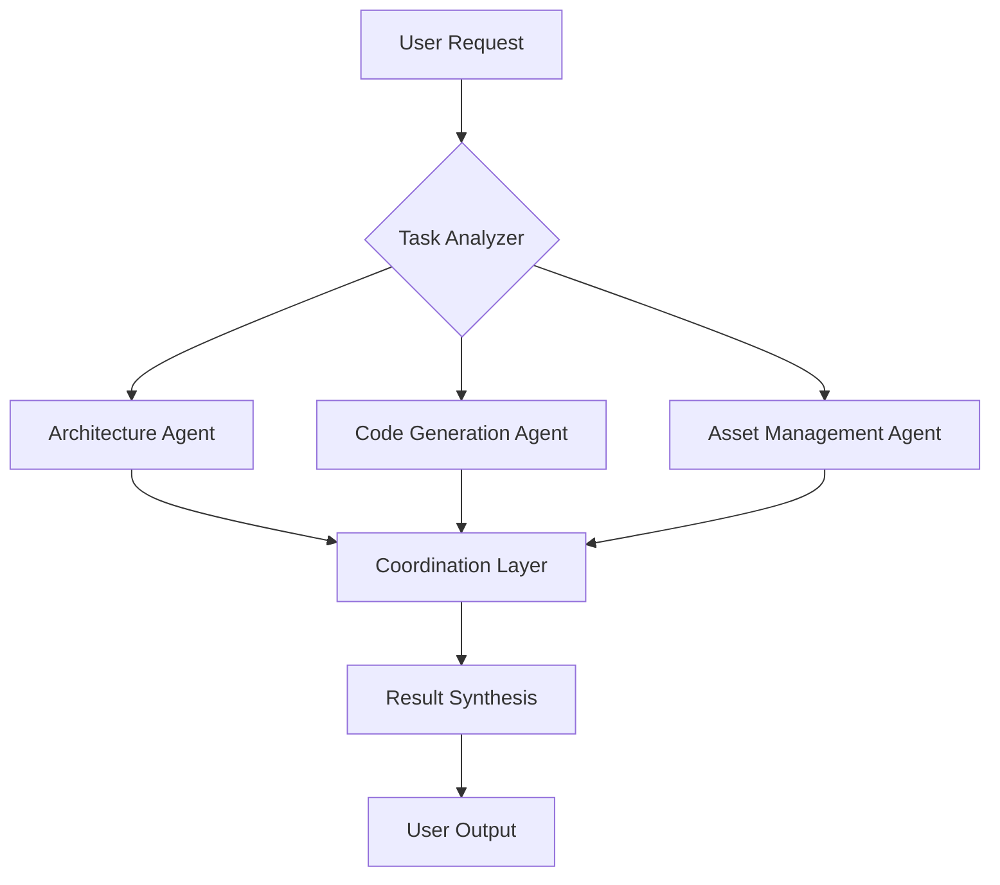

# Unity Copilot Agents

## Overview

Unity Copilot is an AI-powered development assistant plugin for Unity that leverages specialized agents to enhance your game development workflow. Each agent is designed to handle specific tasks, from code generation to asset management, providing intelligent assistance throughout your development process.

## Agent Architecture

### What are Agents?

Agents in Unity Copilot are autonomous AI-powered assistants that:
- Understand Unity-specific contexts and patterns
- Perform specialized development tasks
- Learn from your project structure and coding style
- Provide intelligent suggestions and automation
- Work collaboratively to solve complex problems

### Agent Types

Unity Copilot supports multiple agent types, each specialized for different aspects of Unity development:

## Available Agents

### 🔧 Code Generation Agent
**Purpose**: Generates Unity-specific C# code based on natural language descriptions

**Capabilities**:
- MonoBehaviour script generation
- ScriptableObject templates
- Editor script scaffolding
- Custom inspector creation
- Attribute-based code generation

**Usage Example**:
```
"Create a player controller with WASD movement and jump"
→ Generates complete PlayerController.cs with movement logic
```

### 🎨 Asset Management Agent
**Purpose**: Assists with asset organization, import settings, and optimization

**Capabilities**:
- Batch asset processing
- Import settings optimization
- Asset naming convention enforcement
- Texture compression recommendations
- Prefab organization

**Usage Example**:
```
"Optimize all textures in the Characters folder for mobile"
→ Applies appropriate compression and size settings
```

### 🔍 Refactoring Agent
**Purpose**: Analyzes and improves existing code quality

**Capabilities**:
- Code smell detection
- Performance optimization suggestions
- Naming convention standardization
- Dependency injection patterns
- SOLID principle enforcement

**Usage Example**:
```
"Refactor this manager to use dependency injection"
→ Restructures code with proper DI patterns
```

### 📚 Documentation Agent
**Purpose**: Generates and maintains code documentation

**Capabilities**:
- XML documentation comments
- README generation
- API documentation
- Code examples
- Tutorial creation

**Usage Example**:
```
"Document all public methods in this class"
→ Adds comprehensive XML comments
```

### 🧪 Testing Agent
**Purpose**: Creates and manages unit and integration tests

**Capabilities**:
- Test case generation
- PlayMode test creation
- EditMode test scaffolding
- Test coverage analysis
- Mock object generation

**Usage Example**:
```
"Create unit tests for the inventory system"
→ Generates comprehensive test suite
```

### 🎮 Gameplay Pattern Agent
**Purpose**: Implements common game design patterns and systems

**Capabilities**:
- State machine implementation
- Observer pattern setup
- Object pooling systems
- Event system creation
- Command pattern implementation

**Usage Example**:
```
"Implement a state machine for enemy AI"
→ Creates complete state machine structure
```

### 🏗️ Architecture Agent
**Purpose**: Designs and maintains project architecture

**Capabilities**:
- Folder structure organization
- Layer separation
- Service locator patterns
- Modular system design
- Assembly definition management

**Usage Example**:
```
"Organize project using clean architecture"
→ Creates proper folder structure and assemblies
```

## Agent Communication

### Collaborative Workflows

Agents can work together to solve complex tasks:

**Example Workflow**: Creating a New Feature
1. **Architecture Agent** → Designs the system structure
2. **Code Generation Agent** → Creates initial scripts
3. **Refactoring Agent** → Optimizes the implementation
4. **Testing Agent** → Generates test coverage
5. **Documentation Agent** → Adds documentation

### Agent Coordination



## Using Agents

### Basic Usage

Access agents through the Unity Copilot window:
1. Open `Window > Unity Copilot > Agent Console`
2. Select the appropriate agent or use natural language
3. Describe your task
4. Review and apply the agent's suggestions

### Natural Language Interface

Unity Copilot's natural language processor automatically routes requests to appropriate agents:

```
User: "Create a health system with damage and healing"
→ Routes to: Code Generation Agent + Gameplay Pattern Agent
→ Result: Complete health system implementation
```

### Agent Configuration

Configure agent behavior in `Window > Unity Copilot > Settings`:

- **Creativity Level**: How much the agent explores alternative solutions
- **Code Style**: Preferred coding conventions and patterns
- **Verbosity**: Amount of explanation provided
- **Auto-Apply**: Automatically apply suggestions vs manual review

## Agent Learning

### Context Awareness

Agents learn from your project:
- Existing code patterns and style
- Naming conventions
- Project structure
- Used frameworks and libraries
- Team preferences

### Continuous Improvement

Agents improve through:
- **Feedback Loops**: Rate agent suggestions to improve future responses
- **Pattern Recognition**: Learn commonly used patterns in your project
- **Error Correction**: Adapt based on compilation errors and runtime issues

## Custom Agents

### Creating Custom Agents

Extend Unity Copilot with project-specific agents:

```csharp
using YourCompany.UnityCopilot.Editor;

[CustomAgent("CustomGameplayAgent")]
public class CustomGameplayAgent : CopilotAgent
{
    public override string AgentName => "Custom Gameplay Agent";
    public override string Description => "Handles game-specific patterns";
    
    public override AgentResponse ProcessRequest(AgentRequest request)
    {
        // Your custom agent logic
        return new AgentResponse(/* ... */);
    }
}
```

### Agent Development Kit

The Unity Copilot SDK provides:
- Base agent classes
- Context extraction utilities
- Code generation helpers
- Unity API knowledge base
- Testing frameworks

## Best Practices

### When to Use Agents

✅ **Good Use Cases**:
- Repetitive boilerplate code
- Initial implementation scaffolding
- Refactoring large codebases
- Learning new Unity patterns
- Generating test coverage

⚠️ **Use with Caution**:
- Complex game-specific logic
- Performance-critical code
- Security-sensitive implementations

### Agent Limitations

Agents are powerful but have limitations:
- May not understand highly domain-specific requirements
- Generated code should always be reviewed
- Complex logic may require human refinement
- Context window limitations for very large projects

### Security Considerations

- Agents operate locally within Unity Editor
- No code is sent to external servers (configurable)
- Review all generated code before committing
- Use version control for all agent modifications

## Agent Metrics

### Performance Indicators

Monitor agent effectiveness:
- **Acceptance Rate**: Percentage of suggestions applied
- **Time Saved**: Estimated development time reduction
- **Error Rate**: Compilation/runtime errors in generated code
- **Refactor Impact**: Code quality improvements

### Analytics Dashboard

View agent metrics in `Window > Unity Copilot > Analytics`:
- Most used agents
- Success rates
- Time savings
- Code quality trends

## Future Agents

### Planned Additions

- **Shader Agent**: HLSL/ShaderGraph generation
- **UI Agent**: Unity UI and UI Toolkit creation
- **Animation Agent**: Animator controller setup
- **Multiplayer Agent**: Netcode pattern implementation
- **Optimization Agent**: Performance profiling and optimization

## Support & Feedback

### Improving Agents

Help make agents better:
- Rate each agent interaction
- Report inaccurate suggestions
- Request new agent capabilities
- Share successful patterns

### Community Agents

Share and download community-created agents:
- Agent marketplace (coming soon)
- Open-source agent repository
- Best practices sharing
- Pattern libraries

## Resources

- [Agent API Documentation](Documentation~/AgentAPI.md)
- [Creating Custom Agents Guide](Documentation~/CustomAgents.md)
- [Agent Best Practices](Documentation~/AgentBestPractices.md)
- [Troubleshooting Agents](Documentation~/AgentTroubleshooting.md)

---

**Note**: Unity Copilot agents are designed to augment your development process, not replace developer expertise. Always review, test, and understand generated code before using it in production.

## License & Attribution

Agents use AI models that respect intellectual property and licensing. Generated code is provided under the same license as Unity Copilot (MIT) and does not introduce external licensing obligations.

---

*Unity Copilot - Intelligent Development Assistance for Unity*

